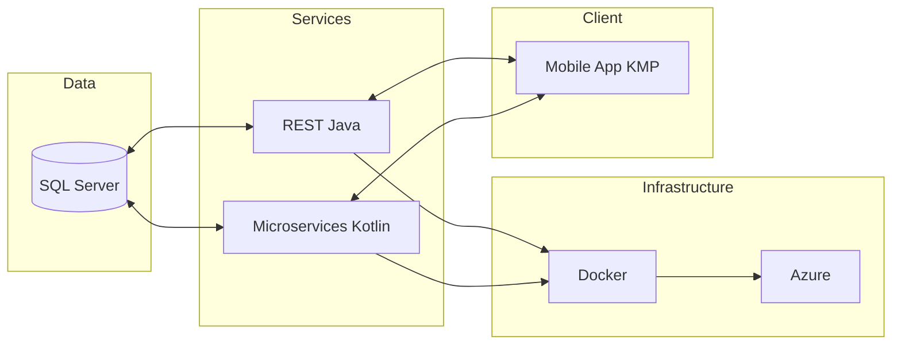

# SYSTEM DASHBOARD — AI Engineer

Este es el centro de monitoreo visual de los flujos de ejecución. Actualizado automáticamente por la Skill `generate-dashboard`.

## 🟢 Estado de los Nodos (Ecosistema)

## 🛠️ Ejecución de Flujos (Modo n8n)

| Nodo | Agente | Estado | Última Acción |
| :--- | :--- | :--- | :--- |
| **DB Node** | DBA | 🟢 OK | Flyway Migrations al día |
| **Backend Node** | Web Dev | 🟢 OK | Endpoints Login validados |
| **Infra Node** | DevOps | 🟡 Idle | Esperando nuevo build |
| **Mobile Node** | Mobile Dev | 🟢 OK | Navegación integrada |

## 📂 Repositorios y Git
- **reloaderproject-rest:** `main` [Sync]
- **reloaderproject-ms-:** `main` [Sync]
- **ReloaderGames:** `main` [Sync]

> [!TIP]
> Para actualizar este tablero, ejecuta la skill: `ai-engineer/skills/generate-dashboard.ps1`
